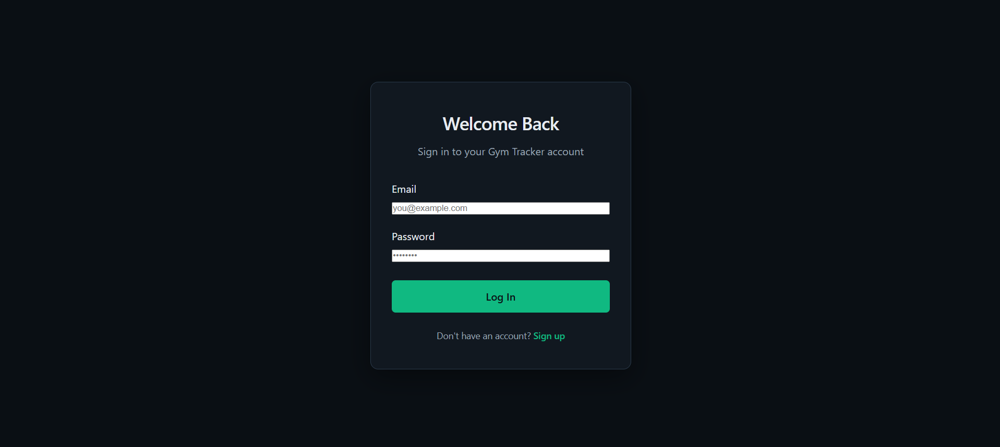
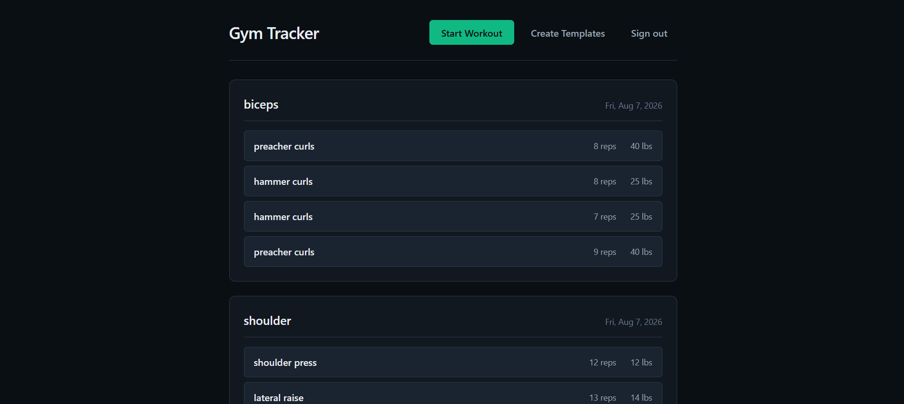
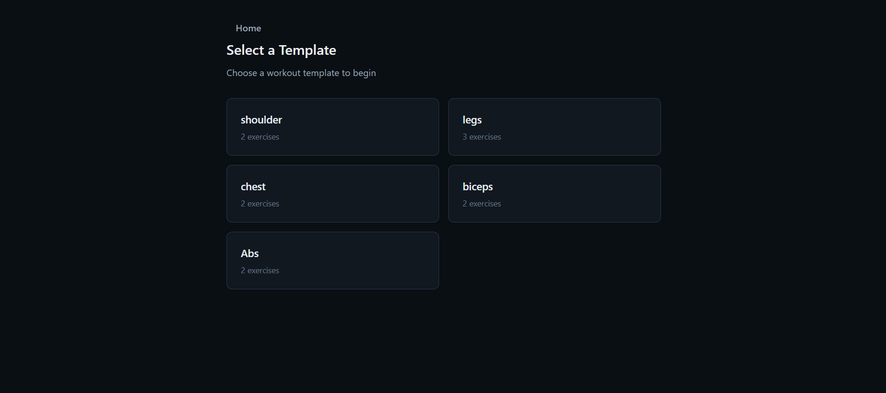
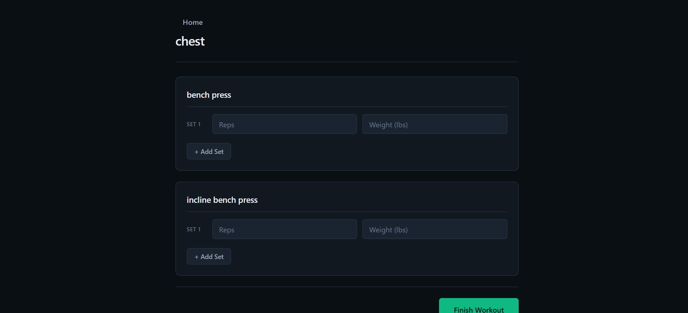

# Gym Tracker

A full-stack app for creating workout templates, logging sets, reps, and weights, and reviewing workout history.
## Live Demo:
https://gym-tracker-livid-nine.vercel.app/login

## Features
- User authentication and authorization
- Create, read, update, and delete workouts
- Workout logging with sets, reps, and weights
- Workout history
- Supabase Row Level Security (RLS)

## Technologies Used
- Next.js
- React
- Javascript
- Supabase
- PostgreSQL
- Vercel

## Database Schema

**`templates`** — user-created workout plans

| Column | Type | Description |
|---|---|---|
| `id` | int8 | Primary key |
| `name` | text | Template name (e.g. "Chest Day") |
| `exercises` | text[] | List of exercise names |
| `user_id` | uuid | Owner (references `auth.users`) |

**`workouts`** — logged sets from completed workouts

| Column | Type | Description |
|---|---|---|
| `id` | int8 | Primary key |
| `template_id` | int8 | References `templates.id` |
| `exercise` | text | Exercise name |
| `reps` | int4 | Reps performed |
| `weight` | float8 | Weight used |
| `workout_session_id` | int8 | Groups rows from the same session |
| `user_id` | uuid | Owner (references `auth.users`) |

## Pictures

## Future Improvements
- Workout progress and volume analytics
- Personal record tracking
- Exercise progress charts
- Improved mobile experience
- AI-powered workout recommendations
